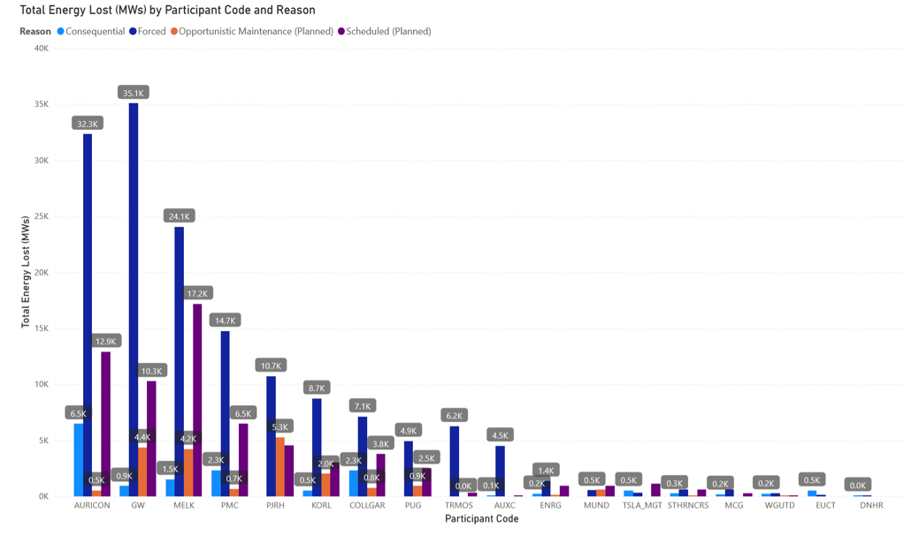
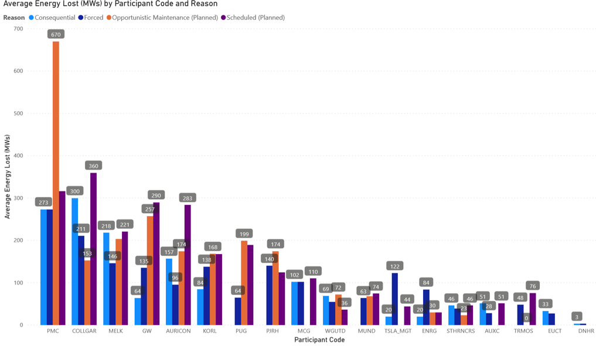
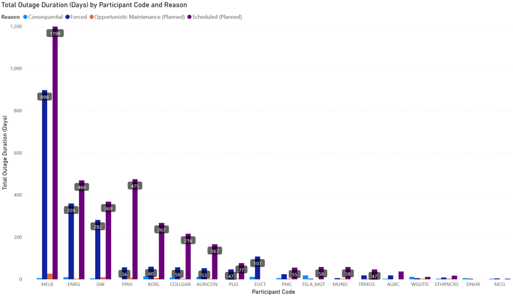
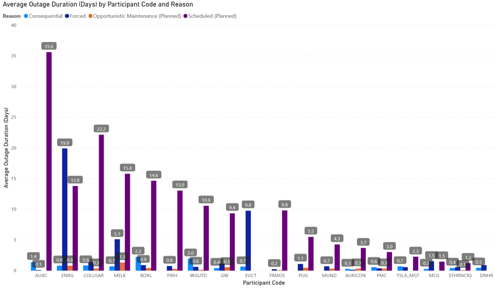

# AEMR Power Loss Analysis

> Project Overview

During the years of 2016 and 2017, eighteen companies within the AEMR (American Energy Market Regulator) reported an increasing amount of outages. As of the publishing of this project, The AEMR categorizes outages into one of four types: forced (unplanned, direct failure of company), consequential (unplanned, failure caused by forces outside of company control), opportunistic (unscheduled maintenance event lasting less than 48 hrs), and planned (maintenance events accounted for by company). At the time of the commission, the AEMR exclusively punished forced outages - that is, any outage that is unplanned by the AEMR and caused by a direct failure of the company's asset(s). The AEMR wanted to know how best to assess company performance and to ensure less outages occur in the years to come.

> Methodology

The bulk of my exploration for this project happened in SQL. All code that I used, for those curious, can be found [here](https://github.com/jenningsconnor/AEMR_power_companies). Before organizing data by company, I decided to aggregate data in order to gauge which outage event stood out as the one most responsible for energy lost. Then, I decided to split up the four outage events by company type. I then sorted the data and grouped it per company in order to determine total energy lost, average energy lost per outage event, total outage duration, and average outage duration per event. After each query I downloaded a csv version of the transformed data so that I could create visualizations in Power BI utilizing the data. 

> Key insights

The short version is this: the AEMR should punish companies based on total energy lost. Doing so based on lengths of outages or average energy lost targets companies that aren't responsible for the greatest amount of energy lost. For those interested in a more detailed breakdown, keep scrolling.

Before we even get to the breakdown by companies, we should discuss the breakdown of energy lost by outage type. Of the four categories, forced outages was by far the most responsible at 60.2%. Scheduled outages were responsible for 25.7% of all energy lost. It would be wise to ensure going forward that scheduled outages do not result in an increase in power lost in the future.

As for the particular categories, below is a dashboard of all the companies with the total amount of energy lost during the two years. 

   

 

As you can see AURICON, GW, MELK, and PMC are the four main culprits concerning total energy lost. The AMER should dole out the harshest penalties to these four companies.  

Now, compare the above with the three dashboards below: average energy lost, total outage duration, and average outage duration.

 

 

 

 

Notice how in other categories, companies that are at the top for total energy lost aren't always at the top for other categories. Because of this, it is essential for the AEMR to investigate companies attempting to skirt penalties by potentially having shorter outage lengths but lose more energy. 

> Links

[GitHub Repository](https://github.com/jenningsconnor/AEMR_power_companies)  
