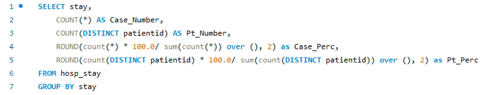

# Analyzing Hospital Stay Legnths

A brief note; this project will be a bit different than some of my others. Nevertheless, I put this here to showcase not only my ability to work with a limited dataset but to show how we can improve what data we have. 

> Project Overview

Given the impact of the Covid-19 pandemic and the challenges it has presented the American people, it's important to evaluate how we can improve our healthcare systems. This inspired me to work on a data project related to healthcare. To be precise, I wanted to work on a SQL-based data project given the demand for analysts fluent in SQL in healthcare. A colleague of mine directed me to a data set with the goal being to determine what factors play a role in increasing a patient's length of stay at a hospital. After an initial scan of the data, I downloaded the set with the goal being to transform the data set and derive as many insights as I can from it.

> Methodology

I used my own MySQL for the bulk of the exploration and transformation of the data. All code can be found here (there's also a repository link at the end of this document). Once I uploaded the data into MySQL, I did a quick examination to see what the data showed. I immediately noticed a somewhat large red flag; stay lengths are divided into ranges (0-10, 11-20, 21-30, etc.), making what could be a numerical variable a categorical one. As soon as I saw this, I had to change my approach completely. I could no longer calculate average stay length based on various factors combining together (age range, hospital, patient's city, number of extra rooms available). Instead, I decided to transform the data so that cases would be group by a given category and then have the stay length as a subcategroy further dividing the data. Essentially, my output for my code looked like this:

 

 

Though I could have created a regression equation by changing all the categories into numerical values, I decided against this. Part of this, admittedly, was because I wanted to use SQL for a project and not rely on Python. However, I also believe given the limits of this dataset it would be best to keep it as is and count up the raw numbers of cases divided by their respective categories. Not only would this allow someone to determine the percentages of which cases fall into a given category, it would also allow someone to see which percentage of cases within each category have higher or lower stay lengths.  

Another interesting thing to note about this dataset; case ID and patient ID are both present. Given this, for most of my exploration I decided to count both the number of patients and the number of cases per each grouping I created. Given how there were over 300,000 cases and just over 90,000 patients, I believe it's important we 

> Key insights

I'd like to focus on what isn't present in the dataset: patient biometrics and demographics. Right off the bat, any results that can be gleaned from this data set will be somewhat limited. Sure, 

   

(insert photo)

 

As you can see...

> Links

[GitHub Repository](https://github.com/jenningsconnor/hospitalstayanalysis)  
[Kaggle Dataset](https://www.kaggle.com/nehaprabhavalkar/av-healthcare-analytics-ii)
