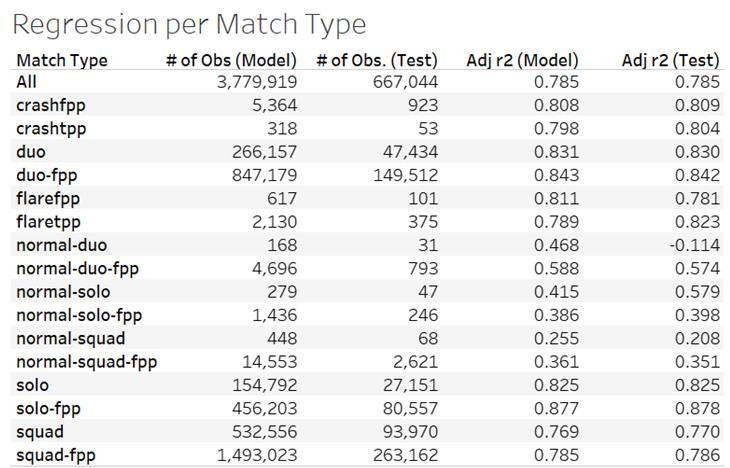

# Analyzing Hospital Stay Legnths

> Project Overview

Given the impact of the Covid-19 pandemic and the challenges it has presented...

> Methodology

I predominantly used SQL for...

> Key insights

Below are insights from my project...

   

 

As you can see...

> Links

[GitHub Repository](https://github.com/jenningsconnor/hospitalstayanalysis)  
[Kaggle Dataset](https://www.kaggle.com/nehaprabhavalkar/av-healthcare-analytics-ii)
