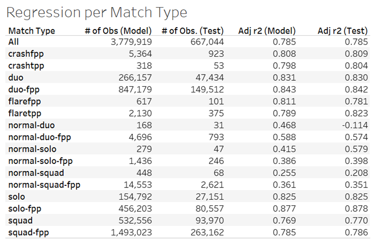

# Springboard Capstone Project - PUBG

> Project Overview

Player Unknown's Battleground has been credited as popularizing the battle royale game mode. Though its concurrent player count of about 100k is a far cry from its all-time high of 3 million, PUBG's role as a blueprint for other battle royale games - most notably the wildly successful Fortnite. Given the game's popularity and impact - and the rising popularity of e-sports as a whole - perhaps the most important question to ask is whether a player's win/loss ratio can be predicted based on their performance. This project aims to answer that question.

> Methodology

For this project I utilized a publicly available data set available <a href="https://www.kaggle.com/c/pubg-finish-placement-prediction/data">here</a>. I split the "train" dataset into two different groups: one "in sample" set to create a preliminary model and an "out of sample" set to test the model. For both the in and out of sample sets, I removed the max place, rank points, and kill points variables in order to avoid potential perfect multicollinearity. I then utilized Python to create the following: boxplots displaying the variance of each variable, heat maps to show each variables correlation to every variable in the equation, and a multivariate regression equation. Once I did this for each of the data sets as a whole, I then replicated the process for each possible match type within the data set. 

> Key insights

The model made with the above methods produced an r2 value of .79 (rounded up from .785), indicating a positive strong correlation between various player statistics and overall win rate. Below is a table that shows each match type's r2 values. 

   

 

For the most part, each match type shows either a noticeably similar or even stronger relationship than the aggregate set. Even event-type matches, the "flare" and "crash" modes, show a remarkable similarity to other match types. The only category of matches with dissimilar r2 values are all custom-game matches - that is, each match type with the normal precursor. While one might be temtped to blame the weaker relationship on a lack of data compared to non-event, non-custom match types, the true cause is the lack of matchmaking. 

 

Custom games, by design, do not have a match making system that other match types have. This means that how players perform in a custom game may not truly be indicative of their overall win percentage. Players in custom games can potentially be of any skill level, whereas in most matchmaking matches there's some semblance of a "normal distribution." That said, in no way does this mean that custom game data is completely irrelevant and should be ignored. Professional teams compete against each other in custom-made games.

>Links

[GitHub Repository](https://github.com/jenningsconnor/PUBG-WinPerc)  
[Kaggle Dataset](https://www.kaggle.com/c/pubg-finish-placement-prediction/data)
